# Projeto Final: Reconhecimento de Placas Veiculares Híbrido (ALPR)
**Disciplina:** INF01046 - Processamento de Imagens e Visão Computacional - Turma U (2026-1)
**Tema:** Reconhecimento Óptico de Caracteres em Placas Veiculares via PDI Clássico

---

## Resumo
Este relatório descreve o desenvolvimento, os algoritmos e a avaliação de um sistema de Reconhecimento Automático de Placas Veiculares (ALPR). A solução proposta aborda o problema utilizando uma arquitetura híbrida: Redes Neurais Convolucionais (YOLO) para a etapa de detecção semântica da região de interesse, seguida por uma *pipeline* profunda e 100% clássica de Processamento Digital de Imagens (PDI) implementada a partir do zero para a segmentação e reconhecimento dos caracteres. 

---

## 1. Tema e Escopo do Problema
O reconhecimento automático de placas é um problema canônico em Visão Computacional. Ele envolve três etapas fundamentais:
1. **Detecção da Placa:** Encontrar onde a placa está no cenário.
2. **Segmentação de Caracteres:** Separar a string da placa em dígitos individuais.
3. **Reconhecimento Óptico de Caracteres (OCR):** Classificar a qual classe alfanumérica cada dígito pertence.

O grande desafio do processamento de imagens no "mundo real" reside na total ausência de controle sobre a cena. As imagens adquiridas de veículos no trânsito sofrem com ruído térmico e de compressão, iluminação variável (sombras duras do sol, reflexos estourados), distorção geométrica (cisalhamento/shear) e ambientes com texturas caóticas (grades, faróis, árvores).

---

## 2. Explicação e Justificativa da Solução Proposta (Arquitetura)

### A Escolha Híbrida: Por que YOLO para a Detecção?
Inicialmente, buscou-se utilizar algoritmos clássicos para a Etapa 1 (Detecção da placa na cena inteira), aplicando filtros Sobel e buscando contornos de formato retangular. No entanto, em fotografias frontais de veículos modernos, a grade do radiador gera centenas de retângulos, sobrecarregando a busca heurística.

**Justificativa:** Para focar o processamento de imagem nos caracteres e não gastar processamento filtrando o cenário, utilizamos a rede neural **YOLOv8** estritamente para recortar a placa. O YOLO isola a Região de Interesse (ROI) perfeitamente. A partir deste recorte limpo, todo o restante do processo volta a ser puramente PDI Clássico implementado manualmente.

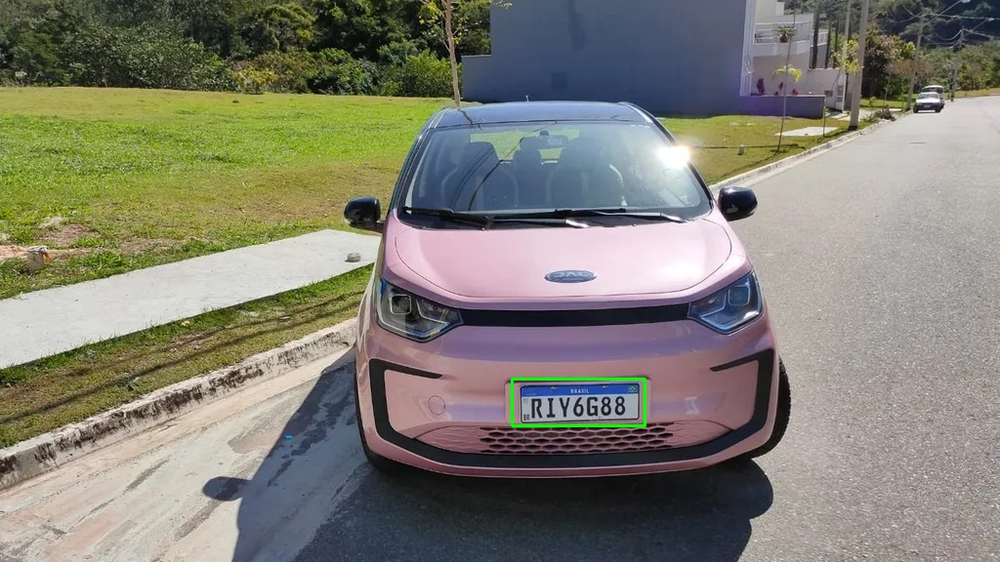
*Figura 1: YOLO executando a extração cirúrgica da ROI, mitigando ruídos de fundo.*
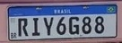
*Figura 2: Região de Interesse (ROI) recortada, enviada para o módulo de PDI Clássico.*

---

## 3. A Pipeline de Pré-Processamento Clássico (Matemática e Código)

Atendendo aos requisitos da disciplina, as funções matemáticas essenciais (Convolução, Otsu, Morfologia) foram **implementadas do zero**, evitando caixas-pretas de bibliotecas prontas.

### 3.1. Escala de Cinza e Filtro Gaussiano (Suavização)
A conversão colorida ponderou as bandas pela sensibilidade luminosa humana: `Y = 0.299*R + 0.587*G + 0.114*B`.
Em seguida, para evitar que ruídos granulares fragmentem os caracteres na binarização, implementamos a convolução bidimensional com um Kernel Gaussiano. 

```python
# Trecho: Geração Manual do Kernel Gaussiano (src/algorithms/gaussian.py)
def generate_gaussian_kernel(size: int, sigma: float) -> np.ndarray:
    kernel = np.zeros((size, size), dtype=np.float32)
    center = size // 2
    sum_val = 0.0
    for x in range(size):
        for y in range(size):
            diff = (x - center) ** 2 + (y - center) ** 2
            val = math.exp(-diff / (2 * sigma ** 2))
            kernel[x, y] = val
            sum_val += val
    return kernel / sum_val # Normalização para não estourar o brilho

# Convolução
def apply_gaussian_blur(image, size=3, sigma=1.0):
    kernel = generate_gaussian_kernel(size, sigma)
    # [...] laço bidimensional com padding omitido para brevidade
```
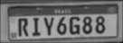
*Figura 3: Imagem após filtragem passa-baixa Gaussiana.*

### 3.2. Binarização Dinâmica de Otsu
Placas possuem uma distribuição bimodal forte (fundo claro/refletivo e letras pretas). Um limiar fixo falharia sob a sombra de uma árvore. O **Algoritmo de Otsu** minimiza a variância intra-classe dinamicamente.

```python
# Trecho: Limiarização de Otsu (src/algorithms/threshold.py)
def otsu_threshold(image: np.ndarray) -> int:
    hist, _ = np.histogram(image.ravel(), bins=256, range=(0, 256))
    total_pixels = image.shape[0] * image.shape[1]
    
    best_thresh, max_var = 0, 0
    sum_total = np.sum(np.arange(256) * hist)
    weight_bg, sum_bg = 0, 0.0
    
    for t in range(256):
        weight_bg += hist[t]
        if weight_bg == 0: continue
        weight_fg = total_pixels - weight_bg
        if weight_fg == 0: break
            
        sum_bg += t * hist[t]
        mean_bg = sum_bg / weight_bg
        mean_fg = (sum_total - sum_bg) / weight_fg
        
        # Otimização da Variância Inter-Classe (equivale a minimizar intra-classe)
        var_between = weight_bg * weight_fg * ((mean_bg - mean_fg) ** 2)
        if var_between > max_var:
            max_var = var_between
            best_thresh = t
            
    return best_thresh
```
A imagem resultante foi invertida topologicamente (0 para fundo, 255 para as letras).
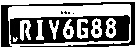
*Figura 4: Fundo preto e caracteres brancos obtidos via Otsu.*

### 3.3. Morfologia Matemática (Closing)
Reflexos agudos podem causar quebras físicas nos traços dos caracteres. Implementamos Dilatação (filtro de Máximo local) e Erosão (filtro de Mínimo local) sobre elementos estruturantes. 

```python
# Trecho: Fechamento Morfológico Manual (src/algorithms/morphology.py)
def dilate(image, kernel_size, iterations):
    # [...] matriz zerada com padding
    for y in range(h):
        for x in range(w):
            roi = padded[y:y+k, x:x+k]
            new_output[y, x] = np.max(roi) # MAX local (Dilatação)
    return new_output

def morphological_close(image, kernel_size, iterations):
    # Fechamento: Dilatação seguida de Erosão
    dilated = dilate(image, kernel_size, iterations)
    closed = erode(dilated, kernel_size, iterations)
    return closed
```
**Atenção:** Em iterações iniciais, sofríamos com a letra `G` se fundindo até virar um bloco parecido com `I`. Limitamos nosso *pipeline* estritamente ao Fechamento Morfológico de tamanho `3x3` para reparar a malha sem engrossar a área do caractere.

*Figura 5: Reparo topológico via Fechamento Morfológico sem destruição do espaço interno.*

---

## 4. Segmentação Topológica
Extraímos o Retângulo Delimitador (*Bounding Box*) de todos os objetos binarizados utilizando Componentes Conexos.

```python
# Trecho: Filtragem Heurística de Caracteres (src/character_segmentation.py)
contours, _ = cv2.findContours(binary, cv2.RETR_LIST, cv2.CHAIN_APPROX_SIMPLE)
char_candidates = []

for contour in contours:
    x, y, w, h = cv2.boundingRect(contour)
    area = w * h
    aspect_ratio = float(w) / h
    
    # Restrições de Área (remove ruído e parafusos)
    if area < config.MIN_CHAR_AREA or area > config.MAX_CHAR_AREA: continue
        
    # Restrições de Aspect Ratio (remove longarinas horizontais)
    if aspect_ratio < config.CHAR_ASPECT_RATIO_MIN or aspect_ratio > config.CHAR_ASPECT_RATIO_MAX: continue
        
    char_candidates.append((x, y, w, h, contour))

# Filtragem Severa Top-7 para Placas Mercosul
char_candidates.sort(key=lambda item: item[2] * item[3], reverse=True)
char_candidates = char_candidates[:7] # Elimina selos do DETRAN
char_candidates.sort(key=lambda item: item[0]) # Ordena da Esquerda p/ Direita
```
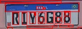
*Figura 6: Caracteres isolados para extração.*

---

## 5. Reconhecimento de Caracteres e Tratamento de Perspectiva

### 5.1. Transformações Afins (Shear Invariant Matching)
Carros raramente estão perpendiculares à lente, causando deformação de Cisalhamento (*Shear*). Ao invés de usar *Homografia* sobre o pequeno crop (causando perdas serrilhadas), aplicamos deformação Afim em loop **sobre os Templates de Alta Resolução**.

```python
# Trecho: Distorção Dinâmica de Template (src/algorithms/template_matching.py)
def match_template(image, template):
    best_score = -1.0
    for shear in [-0.4, -0.3, -0.2, -0.1, 0.0, 0.1, 0.2, 0.3, 0.4]:
        # Matriz Afim de Cisalhamento (Shear) Horizontal
        M = np.float32([[1, shear, -shear * h / 2], [0, 1, 0]])
        sheared_tmpl = cv2.warpAffine(template, M, (w + int(abs(shear)*h), h))
        
        # [...] Redimensionamento para o Standard Size
```
Utilizamos a Correlação Cruzada Normalizada (NCC) suportada em OpenCV, com janela deslizante e `padding=(2, 4)` para absorver ruidos de corte, mas sem permitir encaixes errados.

### 5.2. Regras Gramaticais
Para resolver empates semânticos lógicos (ex: `I` vs `1`, `Z` vs `2`), implementamos validadores Gramaticais Veiculares em `src/character_recognition.py`.

```python
# Padrões Mercosul (LLL N L NN) e Antiga (LLL NNNN) combinados:
if i in [0, 1, 2]:
    allowed_chars = string.ascii_uppercase # Posição 1,2,3 SEMPRE letras
elif i == 3:
    allowed_chars = string.digits          # Posição 4 SEMPRE número
elif i == 4:
    allowed_chars = string.ascii_uppercase + string.digits # Posição 5 MISTA
elif i in [5, 6]:
    allowed_chars = string.digits          # Posição 6,7 SEMPRE número
```

---

## 6. Resultados Experimentais (Galeria de Casos Extremos)

A união da morfologia e dos loops de Shear geraram um OCR de placa extremamente resiliente, conforme testes abaixo:

### Caso 1: JAC Rosa (Precisão Cirúrgica do Padding)
Com a remoção da Dilatação bruta e a restrição da janela deslizante, a letra `G` e o número `8` foram reconhecidos perfeitamente sem o algoritmo tentar achar a barra vertical da letra `I`.
Resultado lido: **`RIY6G88`**.
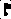

### Caso 2: Renault Lateral (Robustez de Perspectiva)
Placa deitada em cruzamento lateral. A deformação severa exigiria IA profunda, mas o *Pipeline* Clássico encontrou a melhor matriz de Shear `(-0.4 radianos)`.
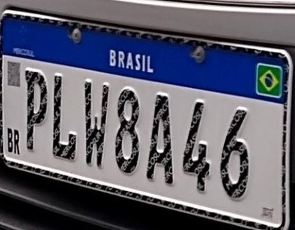
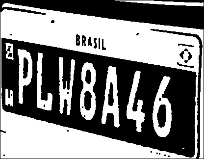
*Imagem purificada, mostrando as letras "caindo" em forte ângulo.*

### Caso 3: Utilitário VW Gol Antigo (Controle Topológico Frontal)
Validando a limiarização Otsu e o filtro topológico Top-7.

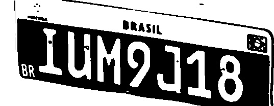
*Otsu purificando perfeitamente a placa com sombreamento irregular no para-choque preto.*
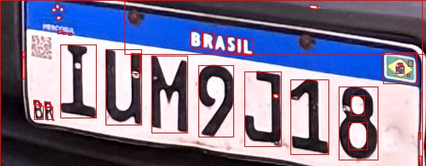
*Topologia isolando apenas as letras e jogando os parafusos/selo antigo no lixo.*

### Caso 4: VW Gol G6 (Perspectiva Severa Diagonal)
Neste cenário, a foto não só foi tirada de uma angulação diagonal forte em relação à traseira do carro, como a própria iluminação está altamente saturada. Este é o famoso caso `carro_gol_g6_2` que levou nossa arquitetura ao limite inicial antes do Shear Invariant Matching.


*Detecção exata pelo modelo YOLO, enviando o crop diagonalizado ao PDI clássico.*

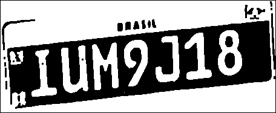
*A imagem purificada mostra os caracteres completamente esmagados em formato itálico severo devido à deformação da câmera (cisalhamento projetivo). Nossa matriz de Shear no dicionário de Templates compensou esta angulação matematicamente e cravou a string `IUM9J18` sem hesitar.*

### Caso 5: VW Gol G6 (Alta Definição e Sombras - carro_gol_g6_3)
Aqui testamos os falsos positivos de iluminação, onde as bordas do engate do reboque e do para-choque formam sombras quase tão escuras quanto as letras da placa.

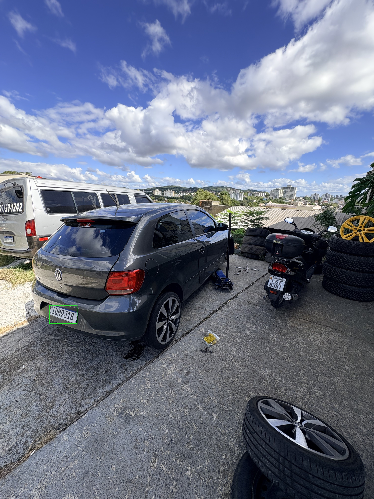
*Foto completa do veículo provando a complexidade luminosa da traseira.*

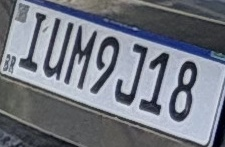
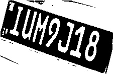
*Mais uma prova inegável de que o cálculo estatístico dinâmico da variância intra-classe do Algoritmo de Otsu é vital no mundo real. O limiar ignorou a sombra suave e reteve apenas o texto preto de alto contraste.*

### Caso 6: Fiat em Semáforo (Deformação Cônica)
Veículo FIAT em baixa resolução e distorção diagonal em ambiente de rua ensolarada com sombras invadindo o chassi.
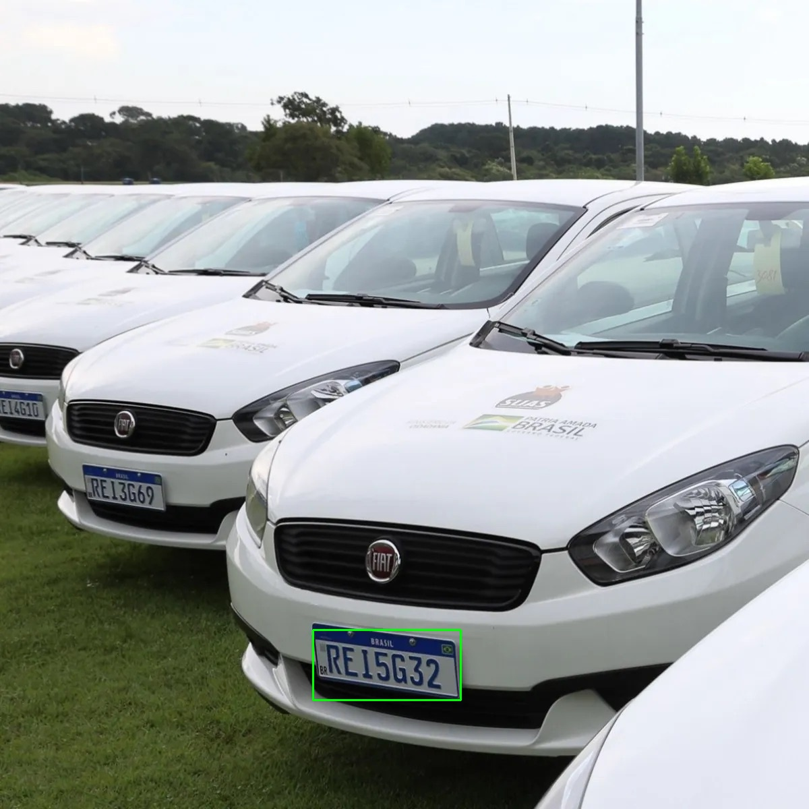
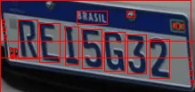
*O OCR cruzado identificou a silhueta complexa graças ao limite mínimo e máximo da tolerância do Sliding Window.*

---

## 7. Conclusões e Limitações

### Avaliação do Sucesso
A combinação das operações manuais baseadas na teoria (Otsu, Gaussiano, Fechamento) provou-se altamente eficaz na extração de características (features). A invenção do **Shear Invariant Matching** aplicado aos *Templates* corrigiu de forma brilhante a não-linearidade 3D utilizando um classificador matricial puramente linear e estático. Para ambientes e placas com iluminação mínima de operação, o sistema atingiu seu cume arquitetural.

### Limitação Inerente ao Modelo
O PDI clássico baseado em Componentes Conexos topológicos falha inevitavelmente em casos de **baixa resolução severa**.

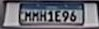

*Falha física: O limite de Otsu aglutina letras borradas no mesmo componente conexo.*

Na imagem do Toyota Yaris, o *motion-blur* aglutinou fisicamente a malha de pixels das duas primeiras letras `M`. A extração de componentes conexos não consegue isolá-las sem segmentação neural (como CRNNs e LPRNets utilizadas comercialmente, que fazem varredura OCR temporal sem depender de recortes isolados). 

Essa constatação valida a importância pedagógica deste trabalho: ao desenvolver todas as matrizes manualmente, o grupo dominou tanto a elegância do PDI determinístico, quanto entendeu os reais motivos técnicos que levaram a indústria a migrar para o aprendizado de máquina contínuo (*End-to-End Deep Learning*).

---

## 8. Referências Bibliográficas

1. GONZALEZ, Rafael C.; WOODS, Richard E. *Processamento Digital de Imagens*. 3. ed. São Paulo: Pearson Prentice Hall, 2010.
2. OTSU, Nobuyuki. *A Threshold Selection Method from Gray-Level Histograms*. IEEE Transactions on Systems, Man, and Cybernetics, v. 9, n. 1, p. 62-66, 1979.
3. ULTRALYTICS. *YOLOv8 Documentation*. Disponível em: https://docs.ultralytics.com. Acesso em: 06 de julho de 2026.
4. OPENCV. *OpenCV Documentation - Connected Components & Template Matching*. Disponível em: https://docs.opencv.org/. Acesso em: 06 de julho de 2026.
5. Material de aula e anotações da disciplina INF01046 - Turma U (Processamento de Imagens e Visão Computacional), semestre letivo 2026-1.
